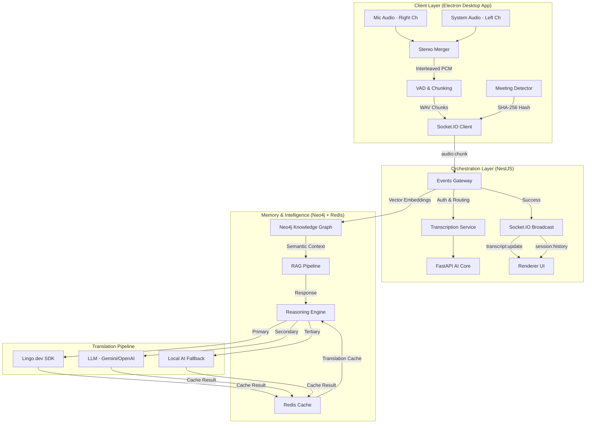

# WisperMentorAI: The Real-Time AI Co-Mentor That Understands, Remembers, and Guides

## The Problem: Meetings Are High-Bandwidth, Humans Are Not

In modern mentoring, technical interviews, and high-value discussions, information flows faster than humans can fully absorb.

You're trying to:

*   Listen carefully
*   Understand complex technical explanations
*   Ask intelligent questions
*   Take notes
*   Remember key decisions

—all at the same time.

This creates **cognitive overload**.

Traditional solutions like recordings and transcripts help—but they fail in critical ways:

*   **Raw Text vs. Understanding**: They provide a wall of words, not actionable insights.
*   **Lack of Semantic Organization**: Knowledge isn't linked; it's just a chronological stream.
*   **Static Context**: They don't help late joiners catch up or answer questions in the moment.
*   **Limited Accessibility**: They often fail to cater to diverse language or accessibility needs.

Most importantly, they don't act as a mentor.

WisperMentorAI changes this completely.

---

# What is WisperMentorAI?

WisperMentorAI is a **real-time AI co-mentor** that listens to meetings, understands context, builds semantic memory, and helps users learn, recall, and interact with meeting intelligence instantly.

It doesn't just record meetings. It **understands** them. It builds a **living knowledge graph**. It responds to your needs in real time, ensuring that no insight is ever lost.

---

# Core Innovation: From Transcription to Semantic Intelligence

Most systems follow this pipeline:
**Audio → Text → Storage**

WisperMentorAI follows a fundamentally different pipeline:
**Audio → Text → Meaning → Memory → Intelligence → Guidance**

This transforms passive recordings into an active intelligence system.

---

# Architecture Overview

The system is built on a distributed real-time AI architecture optimized for low latency and high-level reasoning.



---

# System Architecture Deep Dive

WisperMentorAI consists of five professional-grade layers:

### 1. Client Layer: Real-Time Audio Intelligence
The Electron desktop app captures audio directly from the system and microphone. To achieve high-accuracy speaker identification without heavy ML overhead, we use **Stereo Channel Separation**:
*   **Left channel** → System audio (Participants)
*   **Right channel** → User microphone (You)

This allows immediate diarization based on simple RMS analysis—no ML speaker-ID model required. Audio is further processed with **VAD (Voice Activity Detection)** using real-time RMS energy analysis with configurable silence thresholds (2.5s silence / 20s max chunk), and **noise suppression** via a high-pass filter (85 Hz cutoff) and dynamics compressor. Processed audio is encoded as stereo WAV at 16kHz and streamed via Socket.IO WebSockets.

### 2. Orchestration Layer: The Real-Time Brain
Built with NestJS, this layer acts as the central nervous system. The **Events Gateway** handles:
*   **JWT Authentication** on every WebSocket connection
*   **Session management** — join, leave, and config events
*   **Audio routing** — chunks are forwarded to the FastAPI AI service for transcription
*   **Real-time broadcast** — transcripts are emitted as `transcript:update` events to all session participants
*   **Context backfill** — when a late joiner connects, the gateway queries PostgreSQL and emits all prior transcripts as a `session:history` event, ensuring no context is lost

### 3. AI Intelligence Layer: Understanding Speech
Our FastAPI-powered AI service performs:
*   **ASR**: Using `Faster-Whisper` for 3x speed over original Whisper models, with configurable model size, device, and compute type.
*   **Embeddings**: Generating 384-dimensional semantic vectors using `Sentence Transformers` (`all-MiniLM-L6-v2`).
*   **Speaker Diarization**: Stereo RMS analysis on left/right channels determines whether audio came from the system (participants) or the microphone (user).
*   **Language Detection**: Automatic language identification via Whisper's built-in detection.

### 4. Semantic Memory Layer: The Knowledge Graph + Redis Cache
Unlike typical "chatbot" apps that only use vector databases, WisperMentorAI uses **Neo4j knowledge graphs** backed by a **Redis caching layer**.

**Neo4j** enables **Relationship-Aware Memory**. It stores:
*   **Session → Transcript** relationships with vector embeddings for semantic search
*   **Session → Concept** relationships with examples, rules, and related concepts
*   **Session → Q&A** pairs from the RAG pipeline

This allows complex queries like: *"What did the mentor say about performance when we discussed GraphQL earlier?"*

**Redis** acts as a **Translation Cache**. Every successful translation is cached with the key `trans:{sha256(text)}:{targetLang}` and a 24-hour TTL. When User A translates a phrase to Hindi, and User B later requests the same translation, User B gets it **instantly from Redis at zero API cost**. This saves Lingo.dev credits across the entire team and eliminates redundant API calls. If Redis is unavailable, the app continues normally—cache is best-effort with graceful degradation.

### 5. Meeting Auto-Link: Zero-Config Session Sharing
WisperMentorAI automatically detects active meeting applications by polling desktop window titles every 5 seconds. It recognizes:
*   **Zoom** (window titles containing "Zoom Meeting")
*   **Microsoft Teams** (window titles containing "Microsoft Teams")
*   **Google Meet** (window titles containing "Meet - ")
*   **Webex** (window titles containing "Webex")

When a meeting is detected, a **popup notification** appears: *"Zoom is running. Would you like to start a session?"*

The magic: the full window title (e.g., *"Weekly Standup - Zoom Meeting"*) is hashed into a **deterministic session ID** using SHA-256:
```
SHA-256("weekly standup - zoom meeting") → meeting_a1b2c3d4e5f6...
```

All participants in the same meeting who activate WisperMentorAI get the **exact same session ID**—no manual sharing required. Late joiners instantly receive all prior transcripts via the `session:history` backfill mechanism.

---

# Real-Time Mentor Intelligence (RAG Pipeline)

When a user asks a question, the system triggers its **RAG (Retrieval-Augmented Generation)** pipeline:
1.  **Embedding**: The question is converted into a 384-dim semantic vector.
2.  **Graph Retrieval**: Neo4j performs a vector similarity search across all session transcripts, returning the top 25 most relevant context snippets along with related concepts and style examples.
3.  **Reasoning**: An LLM (Gemini, OpenAI, or local Ollama) analyzes the retrieved context to generate a grounded, hallucination-safe response with confidence scoring and source quotes.
4.  **Translation**: If the user's preferred language isn't English, the answer and quotes are translated via the three-tier translation pipeline.
5.  **Feedback**: The response is displayed to the user via a minimal overlay, with optional text-to-speech output using the Web Speech API.

---

# Accessibility & Advanced Interaction

### Multilingual Intelligence
WisperMentorAI breaks language barriers with its **three-tier translation pipeline** powered by Lingo.dev. Transcripts, session summaries, extracted concepts, and Q&A responses are all translated in real time, enabling users to participate fully regardless of their native language. The **Redis translation cache** ensures that repeated translations are served from cache, reducing latency and saving API credits across the team.

### Real-Time Voice Interaction
Users can interact naturally using voice. A configurable **push-to-talk hotkey** (`Ctrl+Shift+M`) allows you to ask the mentor a question—your voice is transcribed locally via Faster-Whisper, and the RAG pipeline responds with contextual intelligence, as if the AI were a secondary expert in the room.

### Knowledge Export & Visualization
Every session can be exported as **Markdown**, **plain text**, or **JSON**, making it easy to archive or share meeting insights. The built-in **Knowledge Graph Viewer** lets users visually explore how concepts from a session are interconnected, while the **Glossary View** provides a quick-reference dictionary of extracted technical terms.

### Session Summarization
At any time, users can request an AI-generated **session summary** that includes:
*   A concise narrative of what was discussed
*   Extracted **action items** and key decisions
*   **Concepts and terminology** linked in the knowledge graph
*   **Q&A pairs** extracted from the conversation

---

# Reliability: The Zero-Failure Strategy

To ensure WisperMentorAI works in any environment, we use a layered defense strategy across two critical dimensions:

### Translation Resilience
*   **Primary**: **Lingo.dev SDK** for technical precision and speed (with `fast: true` mode).
*   **Secondary**: **LLM Translation** (Gemini/OpenAI/Ollama) for broad language coverage.
*   **Tertiary**: **Local Translation Fallback** via the AI service for mission-critical offline availability.
*   **Circuit Breaker**: If Lingo.dev experiences network failures, the system enters **degraded mode** for 60 seconds, automatically routing to LLM/local fallbacks without user intervention.
*   **Redis Cache**: All successful translations are cached for 24 hours, reducing redundant API calls and providing instant responses for previously-translated content.

### LLM Resilience
Users can configure their preferred LLM provider (Gemini, OpenAI, Anthropic, or local Ollama) and API keys through the Settings panel. If the primary provider is unresponsive, the system falls back gracefully.

---

# Why This Matters

WisperMentorAI transforms meetings from temporary conversations into permanent, searchable intelligence. It removes the human limitations of memory and the technical limitations of language/accessibility, creating a persistent, semantic "Second Brain."

---

# The Vision

**WisperMentorAI is not a transcription tool. It is a second brain.**

It listens. It understands. It remembers. It teaches. It ensures that no knowledge is ever lost.

---
*Built for the Lingo.dev x Hashnode Hackathon 2024.*
